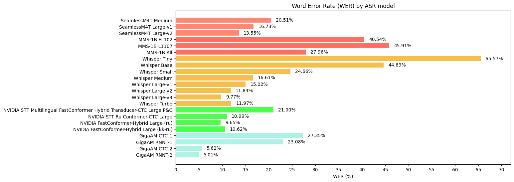

# ASR-models-RU-eval

This repository contains code for evaluating various open-source Automatic Speech Recognition (ASR) models that support local inference on consumer-grade GPUs. The evaluation is performed on a custom dataset consisting of recorded Russian-language lectures from the Higher School of Economics (HSE).

---

## General Information

The repository includes scripts for the core steps of the evaluation process:

- **Audio extraction**: Extracting audio from video files and saving it in WAV format. See [`extract_wav_from_videos.ipynb`](./extract_wav_from_videos.ipynb) for details
- **Generating transcriptions with GigaAM**: Generate raw transcriptions using the GigaAM-V2-RNNT model and enhance them with a language model (GigaAM ignores punctuation and capitalization, so using SileroTE model for its restoration). See [`get_gigaam_transcriptions.ipynb`](./get_gigaam_transcriptions.ipynb) for details. _The generated transcriptions need to be **manually** corrected to create a high-quality dataset for evaluating other ASR models._
- **Publishing the dataset to Hugging Face**: A service script to upload the dataset to Hugging Face as a private repository. Making audio-transcription pairs is more convenient in HF format for further use. See [`make_dataset.ipynb`](./make_dataset.ipynb) for details.
- **Evaluating ASR models**: Evaluate various ASR models using the manually corrected transcriptions as ground truth. See [`evaluation.ipynb`](./evaluation.ipynb) for details. Currently evaluated models include:
  - Whisper (all sizes, from tiny to large-v3-turbo)
  - GigaAM (all versions: V1 and V2, both RNNT and CTC)
  - MMS (1B parameters, 3 different versions)
  - SeamlessM4T (medium, large and large-v2)
  - NVIDIA NeMo models (only supporting Russian language)

The result is presented as a **bar chart** comparing the **Word Error Rate (WER)** on the test set of the dataset for each model at the end of the **evaluation** notebook. The example chart is shown below:

> [!Warning]
> The dataset used for evaluation is not included in this repository due to its size and privacy considerations.

> [!Note]
> The evaluation was performed on a machine with an NVIDIA RTX 4090 GPU, which has 24GB of VRAM. Some models may require more or less VRAM and might not run on different hardware configurations. Also the Python environment was set up using `conda` and `pip` and may not be reproducible as library versions may have changed since the time of writing (May 2025).

> [!Note]
> For better usage of GigaAM models, a slightly modified version of the [GigaAM repository](https://github.com/salute-developers/GigaAM) was used for the current repo: [GigaAM-upgraded repository](https://github.com/KalininVD/GigaAM-upgraded). It includes some bug fixes and improvements for better evaluation pipeline integration. See the [README](https://github.com/KalininVD/GigaAM-upgraded/blob/main/README.md) of that repository for details.